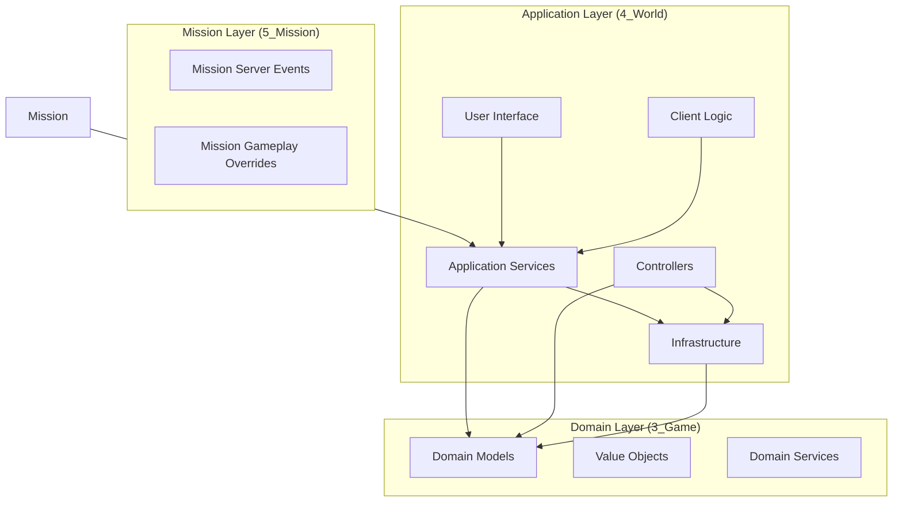
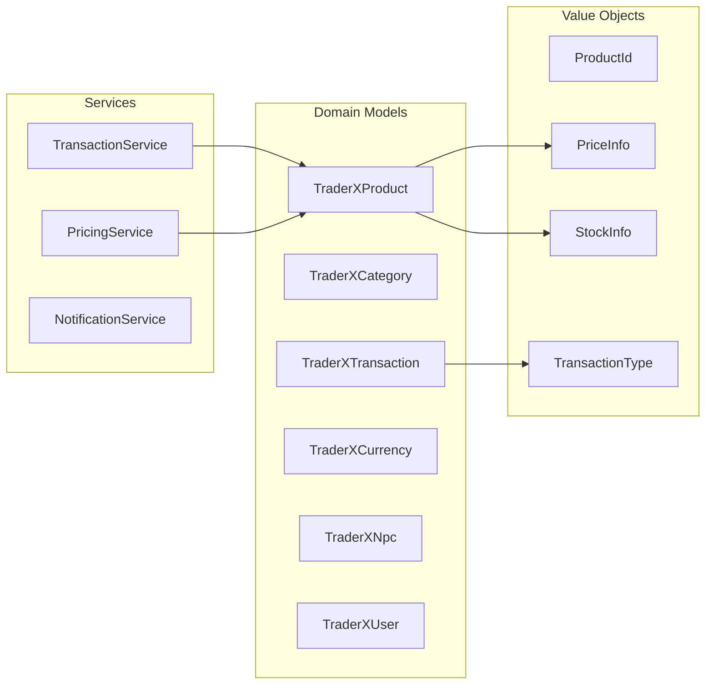
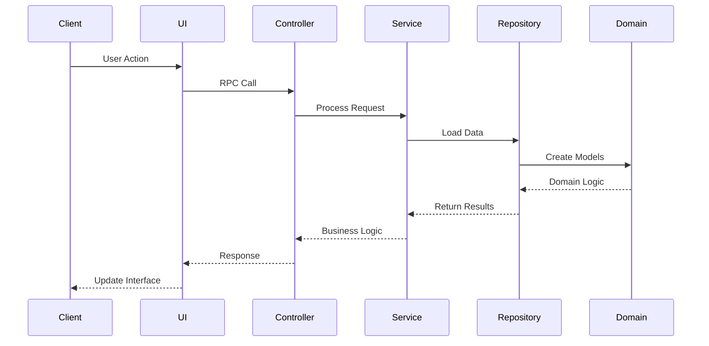

# TraderX

[](https://opensource.org/)
[](https://dayz.com/)
[](https://steamcommunity.com/sharedfiles/filedetails/?id=3560310973)

**TraderX** is a next-generation trading system for DayZ servers, built with modern software architecture principles and designed for extensibility, performance, and ease of use.

## 🚀 Steam Workshop

Find TraderX on the Steam Workshop:
- **Workshop ID**: [3560310973]
- **Direct Link**: [Steam Workshop Link](https://steamcommunity.com/sharedfiles/filedetails/?id=3560310973)

Subscribe to get automatic updates and easy installation for your DayZ server.

## 📋 Table of Contents

- [Features](#-features)
- [Architecture](#-architecture)
- [Installation](#-installation)
- [Configuration](#-configuration)
- [Contributing](#-contributing)
- [License & Usage](#-license--usage)
- [Credits](#-credits)

## ✨ Features

### Core Trading System
- **Dynamic Pricing**: Stock-based coefficient pricing system
- **Multi-Currency Support**: Flexible currency system with custom denominations
- **Product Variants**: Support for different item variants and configurations
- **Attachment System**: Comprehensive weapon and item attachment management
- **Preset System**: Save and load item configurations with attachments
- **Stock Management**: Real-time inventory tracking with configurable limits

### Advanced Features
- **License System**: Trader-specific licensing requirements
- **Vehicle Trading**: Complete vehicle marketplace with parking management
- **Loadout Trading**: Pre-configured equipment packages
- **Progressive Pricing**: Volume-based pricing for bulk transactions
- **Transaction History**: Comprehensive logging and audit trails
- **Notification System**: Rich client notifications with sound effects

### User Experience
- **Modern UI**: Clean, responsive interface with dark theme
- **Real-time Updates**: Live price and stock updates
- **Search & Filtering**: Advanced product discovery
- **Checkout System**: Shopping cart with batch processing
- **Preset Management**: Save favorite item configurations
- **Multi-language Support**: Localization framework

## 🏗️ Architecture

TraderX follows **Domain-Driven Design (DDD)** principles with a layered architecture that ensures maintainability, testability, and extensibility.

### System Overview



### Domain Architecture



### Component Interaction Flow



### Key Architectural Patterns

- **Repository Pattern**: Data access abstraction
- **Service Layer**: Business logic encapsulation  
- **Value Objects**: Immutable data containers
- **Event System**: Decoupled component communication
- **Factory Pattern**: Object creation management
- **Singleton Pattern**: Shared service instances

## 🛠️ Installation

### Prerequisites
- DayZ Server (Version 1.28+)
- CF (Dependency)
- DabsFramework (Dependency)

### Server Installation

1. **Download** TraderX from Steam Workshop
2. **Extract** to your server's mod directory
3. **Add** to server startup parameters:
   ```bash
   -mod=@CF;@DabsFramework;@TraderX
   ```
4. **Configure** using the provided configuration files
5. **Restart** your server

### Client Installation
Players need to subscribe to the mod on Steam Workshop for automatic installation.

## ⚙️ Configuration

### Web Configuration Tool

You can use the web configuration tool at this adress: https://traderpluseditor.dmitri-dev-area.dev

### Basic Setup

TraderX uses JSON configuration files located in your server profile:

```
ServerProfile/
├── TraderX/
│   ├── TraderXConfig/
│   │   ├── GeneralSettings.json
│   │   ├── Categories/
│   │   ├── Products/
│   │   └── NPCs/
│   └── TraderXData/
│       ├── Licenses/
│       └── Transactions/
```

### Key Configuration Files

- **GeneralSettings.json**: Global mod settings
- **Categories/*.json**: Product categorization
- **Products/*.json**: Item definitions and pricing
- **NPCs/*.json**: Trader configurations and locations

### Example Product Configuration

```json
{
    "className": "agaricusmushroom",
    "coefficient": 1,
    "maxStock": -1,
    "tradeQuantity": 78644644,
    "buyPrice": 2,
    "sellPrice": 1,
    "stockSettings": 0,
    "attachments": [],
    "variants": []
}
```

## 🤝 Contributing

TraderX is **open source** and welcomes contributions from the community!

### 🟢 Encouraged Contributions
- **Bug Fixes**: Help improve stability and performance
- **New Features**: Add functionality that benefits the community
- **Documentation**: Improve guides, examples, and API docs
- **Testing**: Add unit tests and integration tests
- **Translations**: Add support for new languages
- **Code Quality**: Refactoring and optimization improvements

### 🔴 Prohibited Usage
- **Repackaging**: Do not redistribute as your own mod
- **Commercial Resale**: Do not sell TraderX or derivatives
- **Closed Source Forks**: Derivatives must remain open source

### Development Setup

1. **Fork** the repository
2. **Clone** your fork locally
3. **Create** a feature branch
4. **Make** your changes following our coding standards
5. **Test** your changes thoroughly
6. **Submit** a pull request with detailed description

### Coding Standards
- Follow DayZ/Enforce Script conventions
- Use Domain-Driven Design patterns
- Include comprehensive logging
- Add unit tests for new features (if possible)
- Document public APIs

## 📄 License & Usage

### Open Source License

TraderX is released under an **open source license** with the following terms:

#### ✅ **Permitted Uses**
- Use on any DayZ server (commercial or non-commercial)
- Modify and extend functionality
- Create derivative works
- Contribute improvements back to the project
- Study the code for educational purposes

#### ❌ **Prohibited Uses**
- Repackaging and redistributing as a different mod
- Selling the mod or any repackaged versions
- Removing attribution or copyright notices
- Creating closed-source derivatives

#### 📝 **Requirements**
- Maintain original attribution
- Keep derivative works open source
- Clearly mark any modifications made
- Respect the community-driven nature of the project

### Attribution

When using or modifying TraderX, please maintain attribution to the original authors and contributors.

## 🎯 Roadmap

### Future Development
- [ ] Bug Fixes
- [ ] Performance Improvements

### Community Requests
We actively listen to community feedback. Submit feature requests through GitHub issues or our Discord server.

## 🏆 Credits

### Core Development Team
- **TheDmitri** - Lead Developer & Architecture
- **FatFly** - UI/UX Designer

### Special Thanks
- **DayZ Community** - Feedback and testing
- **DabsFramework Team** - MVC System
- **Contributors** - All community contributors who help improve TraderX

### Built With
- **DayZ Modding Framework** - Game integration
- **Enforce Script** - Core programming language
- **DabsFramework** - UI and utility framework
- **JSON** - Configuration and data storage

---

## 📞 Support & Community

- **GitHub Issues**: [Report bugs and request features](https://github.com/TheDmitri/TraderX/issues)
- **Discord**: [Join our community server](https://discord.gg/t9YkApe7K9)
- **Steam Workshop**: [Rate and comment](https://steamcommunity.com/sharedfiles/filedetails/?id=2626525656)
- **Documentation**: to be added

---

**Support the project**
[](https://ko-fi.com/thedmitri)

**Made with ❤️ for the DayZ community**

*TraderX - Next Generation Trading for DayZ*
